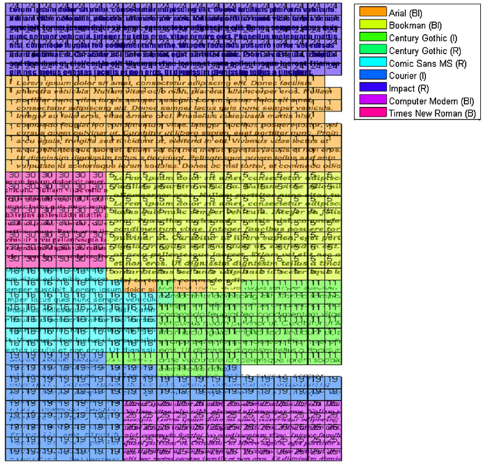

+++
title = "Classifying fonts and calligraphy styles using complex wavelet transform"
date = 2015-07-23T00:00:00

# Authors. Comma separated list, e.g. `["Bob Smith", "David Jones"]`.
authors = ["admin","P. Duygulu","A.E. Cetin"]

# Publication type.
# Legend:
# 0 = Uncategorized
# 1 = Conference paper
# 2 = Journal article
# 3 = Preprint / Working Paper
# 4 = Report
# 5 = Book
# 6 = Book section
# 7 = Thesis
# 8 = Patent
publication_types = ["2"]

# Publication name and optional abbreviated version.
publication = "In *Signal, Image and Video Processing (SIVP)*"
publication_short = "In *SIVP*"

# Abstract and optional shortened version.
abstract = "Recognizing fonts has become an important task in document analysis, due to the increasing number of available digital documents in different fonts and emphases. A generic font recognition system independent of language, script and content is desirable for processing various types of documents. At the same time, categorizing calligraphy styles in handwritten manuscripts is important for paleographic analysis, but has not been studied sufficiently in the literature. We address the font recognition problem as analysis and categorization of textures. We extract features using complex wavelet transform and use support vector machines for classification. Extensive experimental evaluations on different datasets in four languages and comparisons with state-of-the-art studies show that our proposed method achieves higher recognition accuracy while being computationally simpler. Furthermore, on a new dataset generated from Ottoman manuscripts, we show that the proposed method can also be used for categorizing Ottoman calligraphy with high accuracy."

# Featured image thumbnail (optional)
image_preview = ""

# Is this a selected publication? (true/false)
selected = false

# Projects (optional).
#   Associate this publication with one or more of your projects.
#   Simply enter the filename (excluding '.md') of your project file in `content/project/`.
# projects = []

# Tags (optional).
#   Set `tags = []` for no tags, or use the form `tags = ["A Tag", "Another Tag"]` for one or more tags.
tags = []

# Links (optional).
url_pdf = "http://link.springer.com/article/10.1007/s11760-015-0795-z"
url_preprint = ""
url_code = ""
url_dataset = "https://github.com/alicanb/fonts"
url_project = ""
url_slides = "http://www.slideshare.net/alicanb/classification-of-fonts-and-calligraphy-styles-based-on-complex-wavelet-transform"
url_video = ""
url_poster = ""
url_source = ""

# Custom links (optional).
#   Uncomment line below to enable. For multiple links, use the form `[{...}, {...}, {...}]`.
# url_custom = [{name = "Custom Link", url = "http://example.org"}]

# Does the content use math formatting?
math = true

# Does the content use source code highlighting?
highlight = true

# Featured image
# Place your image in the `static/img/` folder and reference its filename below, e.g. `image = "example.jpg"`.
#[image]
#caption = "Example classification of a document"

+++

